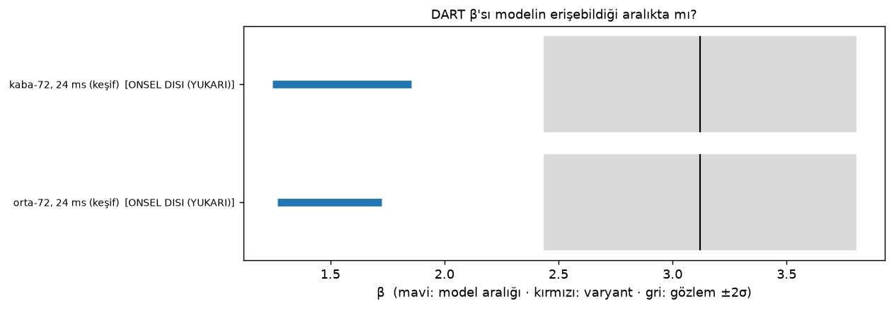

# Bitiş 3 — durum (2026-09-14 akşam)

Bu belge elle yazıldı ve **keşif** sonuçlarını içeriyor. Kilitli karar
`scripts/bitis3_raporu.py` ile TRUBA'daki JSON'lardan otomatik üretilecek
(`kampanya/BITIS3-TASLAK.md`, iş `1561432`).

## 1. Kilitli olarak kanıtlananlar

| | sonuç | kaynak |
|---|---|---|
| Sayısal tutarlılık | `ara` akma kipi Δt bağımlılığını kaldırıyor (J1); A80 kesmesi ve A83 tabanı patlamaları gideriyor (K83: V2 NÖTR) | SONUC-M-N-P-J-T §1, §2c |
| Ayırt edilebilirlik | kesmeli 48 θ havuzu: `Y₀` ve `f` görünür (N) | §2d |
| Kalibre çıkarım (kaba, 24 ms, sentetik gözlem) | zaman örnekli vektörle posterior dış doğrulamada **`Y₀` ve `f`'yi çözüyor**, `α_b`'yi çözmüyor | §2d |
| Kalibre çıkarım (orta, 24 ms) | P-v4 GP ve P-v4b kuadratik: **İKİ EKSEN** (`Y₀`, `f`) | Pv4o |
| Çözünürlük | mutlak gözlenebilirler **yakınsamıyor** (M); `Y₀` kontrastı dayanıklı, `α_b`/`f` değil (M2) | §1, §2c |
| Zaman | `β` 0,1–0,2 s'de platoya ulaşıyor (T orta, Tkt kaba) | S_T, S_Tot |

## 2. Gerçek DART gözlemi — keşif (Protokol D kuralları, 24 ms)

Gözlenen `β` depodaki arayüzden sahnenin kendi hedef kütlesiyle:
**`3,12 ± 0,34`**.

| havuz | model `β` aralığı (önsel boyunca) | kapsama |
|---|---|---|
| kaba-72 | `1,25 – 1,85` | **ÖNSEL DIŞI (YUKARI), +5,2σ** |
| orta-72 | `1,27 – 1,72` | **ÖNSEL DIŞI (YUKARI), +6,2σ** |

Plato anında `β − 1` 24 ms'dekinin `~1,26` katı (T orta: `0,65 → 0,82`).
O çarpanla en büyük model değeri `β − 1 ≈ 0,85 × 1,26 ≈ 1,07`, yani
`β ≈ 2,1` — gözlem bandının `2σ` alt ucunun (`2,44 = 3,12 − 2·0,34`) altında.
(İlk yazımda çarpanı `β`'ya uygulayıp `~2,3` yazmıştım; düzeltildi.)

**Okuma:** mevcut ileri model (yerçekimsiz, `Y₀ ≥ 1e3 Pa`, `μ_f = 0,6`,
yığın `1800 kg/m³`), önsel boyunca DART'ın momentum aktarımını
üretmiyor. Bu, iç yapı posteriorunun gerçek gözlemle **henüz**
kurulamayacağı anlamına geliyor — sentetik çıkarım zinciri çalışıyor,
model–gözlem köprüsü eksik.

## 3. Koşan / bekleyen kilitli deneyler

| | soru | iş |
|---|---|---|
| Q1 `Mt` | plato anında üç çözünürlükte yakınsama | `1561193` |
| Q2/Q3 | plato anında kaba/orta posterior | `1561195` / `1561197` |
| Q4 | ince-72 havuzu | `1561191` |
| Q5 | blok sahasında plato posterioru | `1561239` |
| Q6 | plato anında kontrast dayanıklılığı | `1561241` |
| **U** | hangi model bileşeni `β`'yı gözleme taşıyor (Y₀ < 1e3, μ_f, gözenek, yoğunluk) | `1561438` |
| **D** | plato anında kilitli gözlem kapsaması + posterior | `1561432` |
| **HT** | kilitli Hera krater ön kaydı | `1561443` |

**Not (2026-09-15):** Pgen `1561231` (ince-48), `1561232`, `1561233`
(orta-72) TAMAMLANDI. Tablodaki diğer işler 2026-09-14 19:20'de İPTAL
edildi (Mt `8–35`, Q2/Q3/Q5/Q6, U, N3i `6–13`, bağımlı D/HT). Hesap ortak:
yeniden gönderim **aynı anda en fazla 8 GPU** ve **sıralı** yapılacak
(`scripts/sirali_gonderici.py`); tablo satırları silinmedi, kimlikler
tarihsel.

### 3b. Kütle duyarlılığı (keşif, `scripts/d_kutle_duyarliligi.py`)

Gözlenen `β` hedef kütlesiyle orantılı; bandın `2σ` alt ucunu model
üst sınırına indiren kütle (hacim sabit):

| havuz | `β_max` model | `M*/M₀` | `ρ*` (ρ₀ = 1800) |
|---|---|---|---|
| kaba-72 | 1,85 | 0,760 | ~1370 kg/m³ |
| orta-72 | 1,72 | 0,707 | ~1270 kg/m³ |

Okuma: gözlem–model farkı yalnız kütle belirsizliğiyle kapanacaksa hedef
yığın yoğunluğunun sahnedekinden `%24–29` düşük olması gerekir. Bu,
Protokol U'nun yoğunluk varyantının neden kritik olduğunu gösterir;
kilitli yargı değildir (24 ms, plato çarpanı uygulanmadı).

**Düzeltme notu (2026-09-15, öz denetim):** Bu hesap modelin `β_max`'ını
yoğunluktan **bağımsız** sayıyor; öyle değil. Hedef yoğunluğu düşerse
sahne de değişir (gözeneklilik, dayanım, ejekta) ve modelin `β`'sı da
değişir — muhtemelen artar ve farkı yoğunluk tek başına daha az düşüşle
kapatabilir, ama yönü de büyüklüğü de ölçülmedi. Yani `ρ* ≈ 1270–1370`
bir **üst sınır tahmini** değil, yalnız "gözlenen `β`'nın kütleye
duyarlılığı"dır. Gerçek cevap Protokol U'nun `ρ = 1500` varyantından
(U5, U8) gelecek.

### 3c. KİLİTLİ SONUÇ (2026-09-17): U ve V — model gözleme ulaşmıyor

Protokol U (20 koşu, 0,1 s) ve koşullu Protokol V (10 koşu, 0,2 s, yerçekimi /
hasar) **ikisi de "HİÇBİR VARYANT ULAŞMIYOR"**, kapsam TAM, 30/30 geçerli.
En iyi model `β ≈ 2,05` (Y₀ = 10 Pa), gözlem `3,12 ± 0,34`; en yakın `z = +2,8`
(yoğunluk 1500). Süre (0,2 s), yerçekimi ve hasar açığı kapatmıyor; orta
çözünürlük açığı **büyütüyor**. PROTOKOL-V yorumu: *bu SPH ileri modeli (0,2 s)
DART β'sını üretmiyor → iç yapı çıkarımı gerçek veriyle yapılamaz.* Ayrıntı:
defter KAYIT-057, KAYIT-064; veri `docs/olcumler/U_V_2026-09-17/`.

## 4. Bitiş 3'e kalan

1. D kilitli yargısı (plato anı). Önsel içindeyse → gerçek gözlemle
   posterior. Dışındaysa →
2. U hangi bileşeni gösterirse onunla **ADR + önsel/model genişletme**,
   N/P havuzlarının genişletilmiş önselde yeniden koşulması.
3. Q1'e göre üretim çözünürlüğü; çözünürlük terimi (Mt) posteriora eklenir.
4. HT ön kaydının depoya commit'lenmesi.
